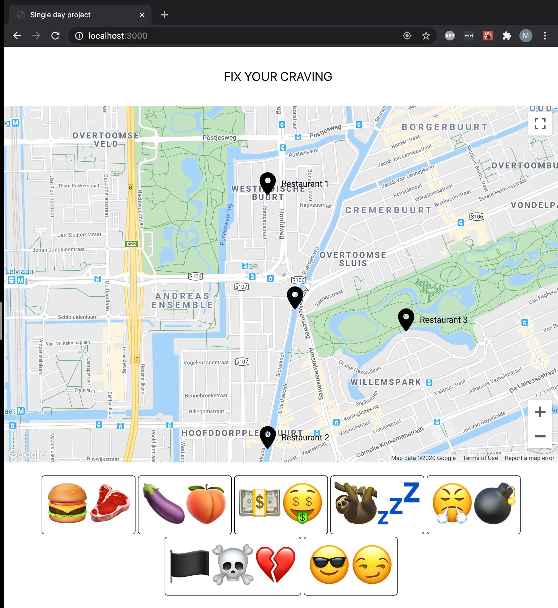
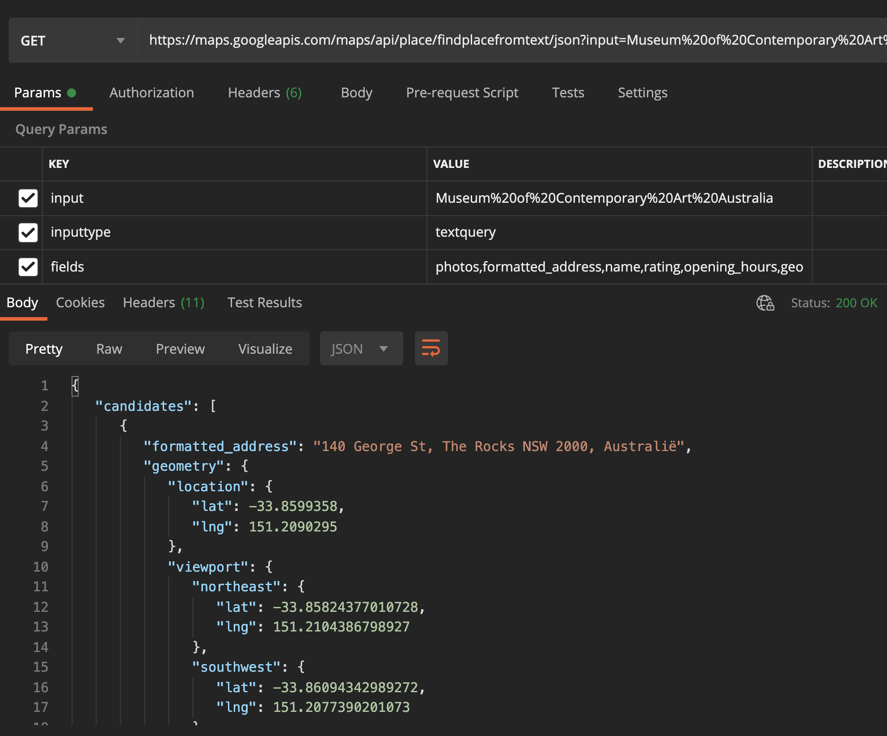

# hackday: fix-my-craving

A one-day project as part of the &lt;/salt> full stack javascript bootcamp. Let the fun begin!

## overview

## requirements

- scoped for one day
- implement a front-end, I will go with React
- implement a back-end, I will use express and the Google Maps API
- live demo the next morning.

> keep it simple, improve in small increments, have fun!

## idea

Based on their current _craving_, users click a theme that matches their craving on the page. Following this choice, a map is presented with a couple of options that will _fix the craving._

### preparations

The first step would be making sure that I can actually access the google maps API. I have run a succesfull test. Second, fetching based on location and a specific kind of place.

- react, to create a single page application
- express server to fetch data
- API: Google Maps JavaScript API > Local Context Library (Beta)
- _API key and access tested with postman :)_

### approach

1. Basic interface
   1. Hardcode current location
   2. Show map with a bunch of random suggestions
2. Start interaction
   1. Get user input from a selected hyperlink
   2. Fetch based on user input
   3. Present map with result
3. Use [geolocation API](https://developer.mozilla.org/en-US/docs/Web/API/Geolocation_API) to get the user's location
   1. Implement geolocation API
   2. Update map based on user location
4. Design
   1. Use emojis as hyperlinks to get input
   2. Theme for the cravings: the seven sins..
5. nice extras
   1. make the page available online
   2. point to custom url
   3. integrate in portfolio website (I may need one first)

## resources

Place search Google [places API](https://developers.google.com/places/web-service/search).  
List of the supported values for the [types property](https://developers.google.com/places/supported_types) (e.g. cafe, night club).  
Markdown: [wiki](https://en.wikipedia.org/wiki/Markdown) and [cheat sheet](https://www.markdownguide.org/cheat-sheet/)
Unicode [emoji list](https://unicode.org/emoji/charts/full-emoji-list.html)  
Setting up boilerplate [tutorial](https://www.freecodecamp.org/news/create-a-react-frontend-a-node-express-backend-and-connect-them-together-c5798926047c/)

API key, first test:

## help

I could still use a bit of help with setting up eslint for the correct version of React, it looks like I have missed something, somewhere.
